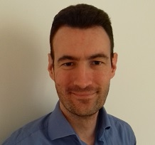

# Alban GIROUX

Product manager with high experience in developement on SAAS application.

Born in 1977. Lives in Bry/Marne (94) - France

## JOBS

### 2019-10 / Actual: Product manager at [EDoc](https://www.edoc.fr/)

* SAAS Product Manager: electronic signature, electronic payroll and electronic safe.
* Set up SCRUM. Team product owner
* Roadmap management with a UI/UX and API approach
* Product Marketing: Price strategy (subscription model), follow-up of partners 

### 2018-08 / 2019-09: Teams manager at [LOOP Software](https://www.loopsoftware.fr/) (A [CEGID](https://www.cegid.com/fr/) company)

* Management: 
    - Set up Scrum. Scrum master of 2 teams (5 + 5 team members)
    - Management: 4 engineers
    - Main goal: Increase the quality of the delivery (code review, set up internal process, anticipate scalability issues ...)
* Stack:
    - Front: Ext.js towards React.js
    - Back: Node.js, Micro service, MongoDB, SQL Server, Kibana, Prometheus, Microsoft graphs
    - Tools: Gitlab, Github, Jira, Teams, Azure Devops, Docker
* The software: more than 100K database, up to 5 000 users/day.

### 2017-01 / 2018-08: Teams & project manager at [CEGID](https://www.cegid.com/fr/)

3 projects concurrently:
* Maintain [Yourcegid Fiscalité](https://www.cegid.com/fr/produits/yc-fiscalite/) (see above)
    - Management: 2 engineers + Scrum master (6 team members)
* Rewrite Yourcegid Consolidation POC:
    - Management: 1 junior engineer
    - Stack: React Redux Typescript GraphQL Node.js SQL Server
* Internal project management of Electronic invoice (chorus) and electronic safe project.  

### 2005-06 / 2016-02: Teams manager at [CEGID](https://www.cegid.com/fr/)

* Management of [Yourcegid Consolidation](https://www.cegid.com/fr/produits/yc-conso/): French leader on small groups
* Then after 2 years, management of [Yourcegid Fiscalité](https://www.cegid.com/fr/produits/yc-fiscalite/) concurrently: French leader in tax management.
* Stack: Delphi, SQL Server, proprietary web server, SVN, Cruise Control. 
* Management:
    - Set up Scrum. Scrum master of 2 teams (6 + 9 team members)
    - Management : up to 10 engineers
* Migration from on-premises to SAAS.

### 2004-06 / 2005-06: Business intelligence consultant at [CEGID](https://www.cegid.com/fr/)

* Missions: budget reporting
* Stack: OLAP, SQL server

### 2003-11 / 2004-05: Chartered Accountant internship

* Audit & Review

### 2003-10 / 2001-03: Main funder of UNIONLAB

* 2 engineers and 3 co-funders
* Developement of an automatic invoice reading system in Java.
* The firm has been liquidated but the engine is still used by [TESSI](https://www.tessi.eu/fr/solution/services/digitalisation-des-processus-documentaires/paiement/dematerialisation-des-factures-fournisseurs-et-processus-procure-to-pay/)

### 1999-10 / 2001-02: Software developer at [COMPTACOM](http://www.compta.com)

* Developement of an automatic bank statement reading system - Visual Basic.

## EDUCATION

* 2000 : D.E.S.C.F (Master's degree in accounting)
* 1999 : D.E.C.F - IUT Nantes
* 1997 : D.U.T. G.E.A (Businness management)
* 1995 : BAC E.S. AB distinction

## EXTRA

* [3 personnal projects](https://github.com/albangiroux/home)
* Married, 3 daughters
* Sport: Volley ball
